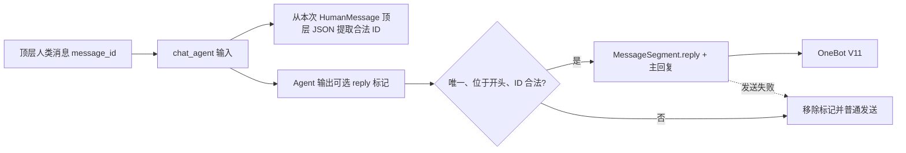

# Chat Reply by Message ID Implementation Plan

> **For agentic workers:** REQUIRED SUB-SKILL: Use superpowers:subagent-driven-development (recommended) or superpowers:executing-plans to implement this plan task-by-task. Steps use checkbox (`- [ ]`) syntax for tracking.

**Goal:** Let `chat_agent` see real OneBot IDs for top-level human messages and emit one validated `[reply: <message_id>]` directive that becomes a native QQ reply.

**Architecture:** Add optional `message_id` fields at the OneBot normalization boundary, derive a replyable-ID allowlist from the exact `HumanMessage` payload sent to `chat_agent`, and parse the Agent directive in `graph/nodes.py`. Carry the validated target through the existing answer callback so `handlers/dialogue.py` can prepend `MessageSegment.reply()` while preserving current text, CQ-at, Markdown-image, face, and retry behavior.

**Tech Stack:** Python 3.12, NoneBot2, OneBot V11, LangChain messages, LangGraph, pytest, Ruff, Pyright.

---

## Execution Constraints

- Read `/Users/treep/Dev/qqbot/hatsume/AGENTS.md`,
  `/Users/treep/Dev/qqbot/hatsume/hatsume/plugins/hatsume-plugin/AGENTS.md`, and
  `/Users/treep/Dev/qqbot/hatsume/tests/AGENTS.md` before editing.
- Run `git status --short` before and after implementation. Preserve the existing
  unrelated edits in `hatsume/plugins/hatsume-plugin/models.py` and
  `tests/test_omni_model.py`.
- Do not modify runtime artifacts under `data/hatsume-plugin`.
- Repository policy forbids commits unless the user explicitly requests them.
  Use the verification checkpoints below without committing.
- Apply TDD within each task: add the focused failing test, run it, implement the
  smallest production change, then rerun the focused test.

## File Map

- Modify `hatsume/plugins/hatsume-plugin/utils/__init__.py`: normalized JSON
  builders own the optional top-level `message_id` field.
- Modify `hatsume/plugins/hatsume-plugin/handlers/dialogue.py`: pass incoming
  OneBot IDs, carry optional reply targets through callbacks, build reply
  segments, and provide reply-send fallback.
- Modify `hatsume/plugins/hatsume-plugin/graph/nodes.py`: extract replyable IDs,
  parse directives, integrate the result into `ai_node`, and preserve batched
  human JSON during finish.
- Modify `hatsume/plugins/hatsume-plugin/prompts.py`: document the input field and
  output directive.
- Modify `docs/arch.md`: update the normalized schema and outgoing reply flow.
- Modify `tests/test_pipeline_json.py`: JSON-builder coverage.
- Modify `tests/test_conversation.py`: OneBot input-boundary and output-sending
  coverage.
- Modify `tests/test_graph_nodes.py`: allowlist, directive, `ai_node`, callback,
  history, and finish-lifecycle coverage.
- Modify `tests/test_ai_json_output.py`: prompt-contract coverage.

### Task 1: Add `message_id` to normalized top-level input

**Files:**
- Modify: `tests/test_pipeline_json.py`
- Modify: `tests/test_conversation.py`
- Modify: `hatsume/plugins/hatsume-plugin/utils/__init__.py`
- Modify: `hatsume/plugins/hatsume-plugin/handlers/dialogue.py`

- [ ] **Step 1: Add failing JSON-builder tests**

Add these cases to `tests/test_pipeline_json.py`:

```python
def test_message_with_message_id(self):
    result = self.utils.message_to_json(
        user_name="张三",
        user_id=123456,
        content="可回复消息",
        msg_time="2026/07/25 12:00:00",
        message_id=987654,
    )
    assert result["message_id"] == 987654

def test_message_without_message_id_omits_field(self):
    result = self.utils.message_to_json(
        user_name="张三",
        user_id=123456,
        content="合成消息",
        msg_time="",
    )
    assert "message_id" not in result
```

Add these cases under `TestBuildForwardJson`:

```python
def test_top_level_forward_with_message_id(self):
    result = self.utils.build_forward_json(
        "转发者", 111, [], "2026/07/25 12:01:00", message_id=987655
    )
    assert result["message_id"] == 987655

def test_forward_without_message_id_omits_field(self):
    result = self.utils.build_forward_json("转发者", 111, [], "")
    assert "message_id" not in result
```

- [ ] **Step 2: Run the builder tests and verify they fail**

Run:

```bash
.venv/bin/python -m pytest tests/test_pipeline_json.py -q
```

Expected: the new calls fail because the builders do not accept
`message_id`, or the new field assertions fail.

- [ ] **Step 3: Implement the optional builder fields**

Update `message_to_json()` in `utils/__init__.py` to this signature and field
insertion:

```python
def message_to_json(
    user_name: str,
    user_id: int,
    content: str | list[dict],
    msg_time: str,
    reply_to: dict | None = None,
    depth: int | None = None,
    message_id: int | None = None,
) -> dict:
    """Build a single message dict in the unified JSON format for LLM input."""
    msg: dict = {
        "type": "message",
        "time": msg_time,
        "user": {"id": user_id, "name": user_name},
        "content": content,
        "reply_to": reply_to,
    }
    if message_id is not None:
        msg["message_id"] = int(message_id)
    if depth is not None:
        msg["depth"] = depth
    return msg
```

Update `build_forward_json()` similarly:

```python
def build_forward_json(
    forwarder_name: str,
    forwarder_id: int,
    messages: list[dict],
    msg_time: str,
    message_id: int | None = None,
) -> dict:
    result = {
        "type": "forward",
        "time": msg_time,
        "user": {"id": forwarder_id, "name": forwarder_name},
        "messages": messages,
    }
    if message_id is not None:
        result["message_id"] = int(message_id)
    return result
```

- [ ] **Step 4: Rerun the builder tests**

Run:

```bash
.venv/bin/python -m pytest tests/test_pipeline_json.py -q
```

Expected: all tests in the file pass.

- [ ] **Step 5: Add failing OneBot-boundary tests**

Append the following helpers and tests to `tests/test_conversation.py`:

```python
def _make_received_event(dialogue, *, message_id: int, segments: list):
    class _GroupEvent:
        group_id = 7
        user_id = 42
        reply = None

        def __init__(self):
            self.message_id = message_id
            self.original_message = dialogue.Message(segments)

    dialogue.GroupMessageEvent = _GroupEvent
    return _GroupEvent()


def test_get_human_message_passes_normal_event_message_id():
    dialogue = _load_conversation_module()
    dialogue.message_to_json.reset_mock()
    dialogue.message_to_json.return_value = {"type": "message"}
    dialogue.has_forward_segment = MagicMock(return_value=None)
    event = _make_received_event(
        dialogue,
        message_id=321,
        segments=[types.SimpleNamespace(type="text", data={"text": "hello"})],
    )

    _, source = asyncio.run(dialogue.get_human_message(MagicMock(), event))

    assert dialogue.message_to_json.call_args.kwargs["message_id"] == 321
    assert source["source_id"] == "m321"


def test_get_human_message_passes_forward_event_message_id():
    dialogue = _load_conversation_module()
    dialogue.build_forward_json.reset_mock()
    dialogue.build_forward_json.return_value = {"type": "forward"}
    dialogue.has_forward_segment = MagicMock(return_value="forward-1")
    dialogue.resolve_forward_content = AsyncMock(return_value=[])
    event = _make_received_event(
        dialogue,
        message_id=654,
        segments=[types.SimpleNamespace(type="forward", data={"id": "forward-1"})],
    )

    asyncio.run(dialogue.get_human_message(MagicMock(), event))

    assert dialogue.build_forward_json.call_args.kwargs["message_id"] == 654
```

- [ ] **Step 6: Run the boundary tests and verify they fail**

Run:

```bash
.venv/bin/python -m pytest \
  tests/test_conversation.py::test_get_human_message_passes_normal_event_message_id \
  tests/test_conversation.py::test_get_human_message_passes_forward_event_message_id -q
```

Expected: the mocked JSON builders were called without `message_id`.

- [ ] **Step 7: Pass the event ID at the normalization boundary**

In `get_human_message()`, use the top-level event ID in both branches:

```python
message_id = int(event.message_id)

if forward_messages is not None:
    msg_json = build_forward_json(
        user_name,
        event.user_id,
        forward_messages,
        msg_time,
        message_id=message_id,
    )
else:
    msg_json = message_to_json(
        user_name,
        event.user_id,
        plain_message,
        msg_time,
        reply_to=reply_to,
        message_id=message_id,
    )
```

Keep `reply_to` unchanged. Keep nested forward construction in
`handlers/forward.py` unchanged.

- [ ] **Step 8: Rerun the task tests**

Run:

```bash
.venv/bin/python -m pytest tests/test_pipeline_json.py tests/test_conversation.py -q
```

Expected: both files pass.

### Task 2: Add pure allowlist and reply-directive helpers

**Files:**
- Modify: `tests/test_graph_nodes.py`
- Modify: `tests/test_ai_json_output.py`
- Modify: `hatsume/plugins/hatsume-plugin/graph/nodes.py`
- Modify: `hatsume/plugins/hatsume-plugin/prompts.py`

- [ ] **Step 1: Add failing helper tests**

Add `import json` near the top of `tests/test_graph_nodes.py`, then add:

```python
def _normalized_text(message_id: int, content: str = "hello") -> dict:
    return {
        "type": "text",
        "text": json.dumps(
            {
                "type": "message",
                "message_id": message_id,
                "time": "",
                "user": {"id": 1, "name": "user"},
                "content": content,
                "reply_to": None,
            },
            ensure_ascii=False,
        ),
    }


def test_extract_replyable_ids_uses_only_top_level_human_json():
    nodes = _load_nodes_module()
    nested = json.dumps(
        {
            "type": "forward",
            "message_id": 20,
            "messages": [{"type": "message", "message_id": 999}],
        }
    )
    messages = [
        types.SimpleNamespace(
            type="human",
            content=[_normalized_text(10), {"type": "text", "text": nested}],
        ),
        types.SimpleNamespace(
            type="ai",
            content=json.dumps({"type": "message", "message_id": 30}),
        ),
        types.SimpleNamespace(type="human", content="not complete json"),
    ]

    assert nodes._extract_replyable_message_ids(messages) == {10, 20}


def test_parse_reply_directive_accepts_one_visible_leading_target():
    nodes = _load_nodes_module()
    cleaned, target = nodes._parse_reply_directive(
        "  [reply: -42] focused answer", {-42}
    )
    assert cleaned == "focused answer"
    assert target == -42


def test_parse_reply_directive_downgrades_invalid_variants():
    nodes = _load_nodes_module()
    cases = [
        ("[reply: 99] unknown", {42}, "unknown"),
        ("[reply: nope] malformed", {42}, "malformed"),
        ("prefix [reply: 42] non-leading", {42}, "prefix  non-leading"),
        ("[reply: 42][reply: 42] duplicate", {42}, "duplicate"),
    ]
    for text, allowed, expected in cases:
        cleaned, target = nodes._parse_reply_directive(text, allowed)
        assert cleaned == expected
        assert target is None
```

- [ ] **Step 2: Run the helper tests and verify they fail**

Run:

```bash
.venv/bin/python -m pytest \
  tests/test_graph_nodes.py::test_extract_replyable_ids_uses_only_top_level_human_json \
  tests/test_graph_nodes.py::test_parse_reply_directive_accepts_one_visible_leading_target \
  tests/test_graph_nodes.py::test_parse_reply_directive_downgrades_invalid_variants -q
```

Expected: the helper attributes do not exist.

- [ ] **Step 3: Implement the pure helpers in `graph/nodes.py`**

Add the pattern beside the existing face and memory patterns:

```python
REPLY_DIRECTIVE_PATTERN = re.compile(r"\[reply:\s*([^\]\r\n]*)\]")
```

Add these helpers before the graph-node section:

```python
def _extract_replyable_message_ids(messages: list[Any]) -> set[int]:
    replyable_ids: set[int] = set()
    for message in messages:
        if getattr(message, "type", None) != "human":
            continue

        content = getattr(message, "content", "")
        text_parts: list[str] = []
        if isinstance(content, str):
            text_parts.append(content)
        elif isinstance(content, list):
            for part in content:
                if isinstance(part, dict) and part.get("type") == "text":
                    text_parts.append(str(part.get("text", "")))
                elif isinstance(part, str):
                    text_parts.append(part)

        for text in text_parts:
            try:
                normalized = json.loads(text)
            except (json.JSONDecodeError, TypeError):
                continue
            if not isinstance(normalized, dict):
                continue
            if normalized.get("type") not in {"message", "forward"}:
                continue
            message_id = normalized.get("message_id")
            if isinstance(message_id, int) and not isinstance(message_id, bool):
                replyable_ids.add(message_id)
    return replyable_ids


def _parse_reply_directive(
    text: str,
    replyable_ids: set[int],
) -> tuple[str, int | None]:
    matches = list(REPLY_DIRECTIVE_PATTERN.finditer(text))
    cleaned = REPLY_DIRECTIVE_PATTERN.sub("", text).strip()
    if len(matches) != 1:
        return cleaned, None

    match = matches[0]
    if text[: match.start()].strip():
        return cleaned, None

    try:
        target = int(match.group(1).strip())
    except ValueError:
        return cleaned, None
    if target not in replyable_ids:
        return cleaned, None
    return cleaned, target
```

This intentionally does not recurse into normalized objects.

- [ ] **Step 4: Rerun the helper tests**

Run:

```bash
.venv/bin/python -m pytest \
  tests/test_graph_nodes.py::test_extract_replyable_ids_uses_only_top_level_human_json \
  tests/test_graph_nodes.py::test_parse_reply_directive_accepts_one_visible_leading_target \
  tests/test_graph_nodes.py::test_parse_reply_directive_downgrades_invalid_variants -q
```

Expected: all three tests pass.

- [ ] **Step 5: Add a failing prompt-contract test**

Add to `tests/test_ai_json_output.py`:

```python
def test_role_prompt_documents_native_reply_directive():
    prompts = _load_prompts()
    role = prompts.role_sys_prompt
    assert "message_id" in role
    assert "[reply: <message_id>]" in role
    assert "回复开头" in role
```

- [ ] **Step 6: Run the prompt test and verify it fails**

Run:

```bash
.venv/bin/python -m pytest \
  tests/test_ai_json_output.py::test_role_prompt_documents_native_reply_directive -q
```

Expected: the role prompt does not mention the directive.

- [ ] **Step 7: Document the input field and output contract**

In `prompts.py`, update the input-format lines so only top-level received
messages advertise the optional field, then add the reply instructions before
the CQ-at section:

```text
## 普通消息 (type: "message")
字段：`message_id`(真实QQ消息ID，仅顶层收到的消息出现)、`time`(YYYY/MM/DD HH:mm:ss)、`user`(id+name)、`content`(文本或多模态数组)、`reply_to`(被回复消息，可为null；其中不含message_id)

## 合并转发 (type: "forward")
字段：`message_id`(仅顶层收到的合并转发出现)、`time`、`user`(转发者)、`messages`(子消息数组，子消息不含message_id)、`depth`(嵌套层级，仅嵌套时出现)

# 回复某条消息
如果需要原生回复某条可见的顶层用户消息，在回复开头插入且只插入一次：[reply: <message_id>]
只能使用当前输入历史中真实出现的顶层 `message_id`，不要编造，也不要使用 `reply_to` 或合并转发子消息中的内容作为 ID。
不需要原生回复时，不要输出该标记。
```

- [ ] **Step 8: Rerun helper and prompt tests**

Run:

```bash
.venv/bin/python -m pytest tests/test_graph_nodes.py tests/test_ai_json_output.py -q
```

Expected: both files pass.

### Task 3: Integrate reply selection into `ai_node`

**Files:**
- Modify: `tests/test_graph_nodes.py`
- Modify: `hatsume/plugins/hatsume-plugin/graph/nodes.py`

- [ ] **Step 1: Add failing `ai_node` integration tests**

Add these tests to `tests/test_graph_nodes.py`:

```python
def test_ai_node_sends_valid_reply_target_and_cleans_history():
    nodes = _load_nodes_module()
    nodes.auxiliary_messages_queue.clear()
    nodes.auxiliary_source_queue.clear()
    sent: list[tuple[object, int | None]] = []

    async def answer(msg, reply_to_message_id=None):
        sent.append((msg, reply_to_message_id))

    mock_state = types.SimpleNamespace(
        human_queue=[],
        human_source_queue=[],
        is_graph_running=True,
        current_query_user_id=None,
        end_requested=False,
        ai_answer=answer,
    )
    nodes.bind_state(mock_state)

    class _FakeAgent:
        def with_retry(self, **kw):
            return self

        async def ainvoke(self, *a, **kw):
            return {
                "messages": [
                    types.SimpleNamespace(
                        content="[reply: 4321]focused answer", type="ai"
                    )
                ]
            }

    original_create_agent = nodes.create_agent
    nodes.create_agent = lambda *a, **kw: _FakeAgent()
    human_msg = types.SimpleNamespace(
        type="human",
        content=[_normalized_text(4321, "target message")],
    )
    try:
        result = asyncio.run(nodes.ai_node({"messages": [human_msg]}))
    finally:
        nodes.create_agent = original_create_agent

    assert sent == [("focused answer", 4321)]
    assert result["messages"][0].content == "focused answer"


def test_ai_node_invalid_reply_target_uses_ordinary_send():
    nodes = _load_nodes_module()
    nodes.auxiliary_messages_queue.clear()
    nodes.auxiliary_source_queue.clear()
    sent: list[tuple[object, int | None]] = []

    async def answer(msg, reply_to_message_id=None):
        sent.append((msg, reply_to_message_id))

    mock_state = types.SimpleNamespace(
        human_queue=[],
        human_source_queue=[],
        is_graph_running=True,
        current_query_user_id=None,
        end_requested=False,
        ai_answer=answer,
    )
    nodes.bind_state(mock_state)

    class _FakeAgent:
        def with_retry(self, **kw):
            return self

        async def ainvoke(self, *a, **kw):
            return {
                "messages": [
                    types.SimpleNamespace(
                        content="[reply: 9999]ordinary answer", type="ai"
                    )
                ]
            }

    original_create_agent = nodes.create_agent
    nodes.create_agent = lambda *a, **kw: _FakeAgent()
    human_msg = types.SimpleNamespace(type="human", content=[_normalized_text(4321)])
    try:
        result = asyncio.run(nodes.ai_node({"messages": [human_msg]}))
    finally:
        nodes.create_agent = original_create_agent

    assert sent[0][1] is None
    assert sent[0][0].data["text"] == "ordinary answer"
    assert result["messages"][0].content == "ordinary answer"
```

- [ ] **Step 2: Run the integration tests and verify they fail**

Run:

```bash
.venv/bin/python -m pytest \
  tests/test_graph_nodes.py::test_ai_node_sends_valid_reply_target_and_cleans_history \
  tests/test_graph_nodes.py::test_ai_node_invalid_reply_target_uses_ordinary_send -q
```

Expected: the callback does not receive a reply target and the graph history
still contains the directive.

- [ ] **Step 3: Build one exact invocation list and derive its allowlist**

Replace the inline `ainvoke()` message expression with a local value:

```python
agent_messages = state["messages"][:-1] + mem_msg + [last_human_msg]
replyable_message_ids = _extract_replyable_message_ids(agent_messages)

response = await chat_agent.with_retry(stop_after_attempt=5).ainvoke(
    {"messages": agent_messages},
    {"recursion_limit": 60},
)
```

This guarantees validation uses the exact current, historical, and auxiliary
human content shown to the Agent.

- [ ] **Step 4: Parse the reply directive before face and memory tags**

Immediately after flattening the Agent response, add:

```python
ai_text_history, reply_to_message_id = _parse_reply_directive(
    str(ai_text),
    replyable_message_ids,
)
```

Then use `ai_text_history` as the input to face extraction:

```python
face_emotion: str | None = None
ai_text_clean = ai_text_history
match = FACE_TAG_PATTERN.search(ai_text_history)
if match:
    face_emotion = match.group(1).strip()
    ai_text_clean = FACE_TAG_PATTERN.sub("", ai_text_history).strip()
```

Return history without the reply directive while preserving current face and
memory tag behavior:

```python
return {"messages": [AIMessage(ai_text_history)]}
```

- [ ] **Step 5: Carry the valid target through the answer callback**

Change only the valid-reply branch; leave existing no-reply conversion intact:

```python
elif ai_text_clean:
    _ai_answer = _get_ai_answer()
    if _ai_answer:
        if reply_to_message_id is not None:
            await _ai_answer(
                ai_text_clean,
                reply_to_message_id=reply_to_message_id,
            )
        elif CQ_AT_PATTERN.search(ai_text_clean):
            await _ai_answer(ai_text_clean)
        else:
            for seg in await auto_convert_text(ai_text_clean):
                await _ai_answer(seg)
```

Do not pass a reply target to the later face-image callback.

- [ ] **Step 6: Rerun the integration and existing face/end tests**

Run:

```bash
.venv/bin/python -m pytest \
  tests/test_graph_nodes.py::test_ai_node_sends_valid_reply_target_and_cleans_history \
  tests/test_graph_nodes.py::test_ai_node_invalid_reply_target_uses_ordinary_send \
  tests/test_graph_nodes.py::test_ai_node_suppresses_reply_after_end_conversation_tool \
  tests/test_graph_nodes.py::test_face_tag_stripped_from_user_text_preserved_in_aimessage -q
```

Expected: all four tests pass.

### Task 4: Build and send native OneBot replies

**Files:**
- Modify: `tests/test_conversation.py`
- Modify: `tests/test_graph_nodes.py`
- Modify: `hatsume/plugins/hatsume-plugin/handlers/dialogue.py`
- Modify: `hatsume/plugins/hatsume-plugin/graph/nodes.py`

- [ ] **Step 1: Add failing matcher-send tests**

Add to `tests/test_conversation.py`:

```python
def test_handle_ai_message_prepends_reply_segment():
    dialogue = _load_conversation_module()
    text_seg = types.SimpleNamespace(type="text", data={"text": "answer"})
    dialogue.auto_convert_text = AsyncMock(return_value=[text_seg])
    dialogue.MessageSegment.reply = MagicMock(
        side_effect=lambda message_id: types.SimpleNamespace(
            type="reply", data={"id": message_id}
        )
    )
    matcher = types.SimpleNamespace(send=AsyncMock())

    asyncio.run(
        dialogue.handle_ai_message(
            "answer", matcher, reply_to_message_id=321
        )
    )

    payload = matcher.send.await_args.args[0]
    assert [seg.type for seg in payload] == ["reply", "text"]
    assert payload[0].data["id"] == 321


def test_handle_ai_message_reply_failure_falls_back_to_plain_send():
    dialogue = _load_conversation_module()
    text_seg = types.SimpleNamespace(type="text", data={"text": "answer"})
    dialogue.auto_convert_text = AsyncMock(return_value=[text_seg])
    dialogue.MessageSegment.reply = MagicMock(
        side_effect=lambda message_id: types.SimpleNamespace(
            type="reply", data={"id": message_id}
        )
    )
    matcher = types.SimpleNamespace(
        send=AsyncMock(side_effect=[RuntimeError("reply rejected"), None])
    )

    asyncio.run(
        dialogue.handle_ai_message(
            "answer", matcher, reply_to_message_id=321
        )
    )

    assert matcher.send.await_count == 2
    first_payload = matcher.send.await_args_list[0].args[0]
    assert first_payload[0].type == "reply"
    assert matcher.send.await_args_list[1].args[0] is text_seg


def test_reply_segment_stays_first_with_cq_at_output():
    dialogue = _load_conversation_module()
    dialogue.render_cq_at_placeholders = AsyncMock(
        return_value=("hi @Treep", [123456])
    )
    dialogue.MessageSegment.text = MagicMock(
        side_effect=lambda text: types.SimpleNamespace(
            type="text", data={"text": text}
        )
    )
    dialogue.MessageSegment.at = MagicMock(
        side_effect=lambda uid: types.SimpleNamespace(type="at", data={"qq": uid})
    )
    dialogue.MessageSegment.reply = MagicMock(
        side_effect=lambda message_id: types.SimpleNamespace(
            type="reply", data={"id": message_id}
        )
    )
    matcher = types.SimpleNamespace(send=AsyncMock())

    asyncio.run(
        dialogue.handle_ai_message(
            "hi [CQ:at,qq=123456]",
            matcher,
            group_id=7,
            reply_to_message_id=321,
        )
    )

    payload = matcher.send.await_args.args[0]
    assert [seg.type for seg in payload] == ["reply", "text", "at"]


def test_reply_segment_stays_first_with_rendered_image_output():
    dialogue = _load_conversation_module()
    image_seg = types.SimpleNamespace(type="image", data={"file": "img"})
    dialogue.auto_convert_text = AsyncMock(return_value=[image_seg])
    dialogue.MessageSegment.reply = MagicMock(
        side_effect=lambda message_id: types.SimpleNamespace(
            type="reply", data={"id": message_id}
        )
    )
    matcher = types.SimpleNamespace(send=AsyncMock())

    asyncio.run(
        dialogue.handle_ai_message(
            "# rendered reply",
            matcher,
            group_id=7,
            reply_to_message_id=321,
        )
    )

    payload = matcher.send.await_args.args[0]
    assert [seg.type for seg in payload] == ["reply", "image"]


def test_direct_group_reply_failure_falls_back_to_plain_send():
    dialogue = _load_conversation_module()
    text_seg = types.SimpleNamespace(type="text", data={"text": "answer"})
    dialogue.auto_convert_text = AsyncMock(return_value=[text_seg])
    dialogue.MessageSegment.reply = MagicMock(
        side_effect=lambda message_id: types.SimpleNamespace(
            type="reply", data={"id": message_id}
        )
    )
    bot = types.SimpleNamespace(
        send_group_msg=AsyncMock(side_effect=[RuntimeError("reply rejected"), None])
    )

    asyncio.run(
        dialogue._send_group_ai_message(
            bot,
            7,
            "answer",
            reply_to_message_id=321,
        )
    )

    assert bot.send_group_msg.await_count == 2
    first_payload = bot.send_group_msg.await_args_list[0].kwargs["message"]
    assert first_payload[0].type == "reply"
    assert bot.send_group_msg.await_args_list[1].kwargs["message"] is text_seg
```

- [ ] **Step 2: Run the matcher-send tests and verify they fail**

Run:

```bash
.venv/bin/python -m pytest \
  tests/test_conversation.py::test_handle_ai_message_prepends_reply_segment \
  tests/test_conversation.py::test_handle_ai_message_reply_failure_falls_back_to_plain_send \
  tests/test_conversation.py::test_reply_segment_stays_first_with_cq_at_output \
  tests/test_conversation.py::test_reply_segment_stays_first_with_rendered_image_output \
  tests/test_conversation.py::test_direct_group_reply_failure_falls_back_to_plain_send -q
```

Expected: `handle_ai_message()` does not accept `reply_to_message_id`.

- [ ] **Step 3: Add a reply-segment decorator to the response builder**

Add:

```python
def _prepend_reply_segment(
    segments: list[Any],
    force_message: bool,
    reply_to_message_id: int | None,
) -> tuple[list[Any], bool]:
    if reply_to_message_id is None or not segments:
        return segments, force_message
    return [MessageSegment.reply(reply_to_message_id), *segments], True
```

Extend `_build_ai_response_segments()` with
`reply_to_message_id: int | None = None` and use this complete control flow:

```python
async def _build_ai_response_segments(
    msg: str | Message | MessageSegment,
    group_id: int | None,
    reply_to_message_id: int | None = None,
) -> tuple[list[Any], bool]:
    if isinstance(msg, str):
        segments, force_message = await _build_text_response_segments(msg, group_id)
    elif _is_text_segment(msg):
        segments, force_message = await _build_text_response_segments(
            str(msg.data.get("text", "")),
            group_id,
        )
    elif _segment_type(msg):
        segments, force_message = [msg], False
    else:
        try:
            raw_segments = list(msg)  # type: ignore[arg-type]
        except TypeError:
            segments, force_message = [msg], False
        else:
            segments = []
            force_message = False
            for seg in raw_segments:
                if _is_text_segment(seg):
                    built, force = await _build_text_response_segments(
                        str(seg.data.get("text", "")),
                        group_id,
                    )
                    segments.extend(built)
                    force_message = force_message or force
                else:
                    segments.append(seg)

    return _prepend_reply_segment(
        segments,
        force_message,
        reply_to_message_id,
    )
```

Do not create a reply-only message when conversion produced no content.

- [ ] **Step 4: Extend `handle_ai_message()` and add fallback**

Use this signature:

```python
async def handle_ai_message(
    msg: str | Message | MessageSegment,
    matcher,
    group_id: int | None = None,
    retry: int = 0,
    reply_to_message_id: int | None = None,
) -> None:
```

Pass the target into `_build_ai_response_segments()`. In the send exception
handler, downgrade once before entering the existing ordinary retry loop:

```python
except Exception as e:
    print("Send error: ", e)
    if reply_to_message_id is not None:
        print(
            "Reply target rejected; retrying without reply segment: "
            f"{reply_to_message_id}"
        )
        await handle_ai_message(
            msg,
            matcher,
            group_id=group_id,
            retry=retry,
            reply_to_message_id=None,
        )
        return
    await asyncio.sleep(3)
    print(f"Retry sending message, {retry=}")
    await handle_ai_message(
        msg,
        matcher,
        group_id=group_id,
        retry=retry + 1,
    )
```

- [ ] **Step 5: Update matcher and direct-group callback signatures**

In `user_chat_handle()`, change the callback to:

```python
async def ai_cb(msg, reply_to_message_id=None):
    await handle_ai_message(
        msg,
        user_chat_matcher,
        group_id=event.group_id,
        reply_to_message_id=reply_to_message_id,
    )
```

Add this reusable direct-group helper in `handlers/dialogue.py`:

```python
async def _send_group_ai_message(
    bot: Bot,
    group_id: int,
    msg: str | Message | MessageSegment,
    reply_to_message_id: int | None = None,
) -> None:
    segments, force_message = await _build_ai_response_segments(
        msg,
        group_id,
        reply_to_message_id=reply_to_message_id,
    )
    try:
        await bot.send_group_msg(
            group_id=group_id,
            message=_message_payload_for_segments(segments, force_message),
        )
    except Exception:
        if reply_to_message_id is None:
            raise
        fallback_segments, fallback_force = await _build_ai_response_segments(
            msg,
            group_id,
        )
        await bot.send_group_msg(
            group_id=group_id,
            message=_message_payload_for_segments(
                fallback_segments,
                fallback_force,
            ),
        )
```

Change `_start_conv_for_trigger()`'s closure to accept the optional argument and
delegate non-end sends to `_send_group_ai_message()`:

```python
async def _send_to_group(msg, reply_to_message_id=None):
    if msg == "[CONVERSATION END]":
        conv_state.end_conversation()
        return
    try:
        await _send_group_ai_message(
            bot,
            group_id,
            msg,
            reply_to_message_id=reply_to_message_id,
        )
    except Exception as e:
        print(f"❌ _send_to_group failed: group={group_id} err={e}")
```

- [ ] **Step 6: Keep the existing graph direct-send fallback callback-compatible**

In `graph/nodes.py::_start_direct_conv()`, extend the existing lazy dialogue
import and closure without creating a new module-level handler dependency:

```python
from ..handlers.dialogue import (
    _send_group_ai_message,
    conv_state,
    start_new_conversation,
)

async def _send_to_group(msg, reply_to_message_id=None):
    if msg == "[CONVERSATION END]":
        conv_state.end_conversation()
        return
    try:
        await _send_group_ai_message(
            bot,
            group_id,
            msg,
            reply_to_message_id=reply_to_message_id,
        )
    except Exception as e:
        print(f"❌ _send_to_group failed: group={group_id} err={e}")
```

This reuses the already-existing lazy `graph.nodes -> handlers.dialogue` cycle;
document it in Task 6 rather than adding another initialization path.

- [ ] **Step 7: Update test stubs and rerun sending coverage**

In `tests/test_graph_nodes.py`, add a `reply` factory to the existing
`MessageSegment` stub:

```python
reply=lambda message_id: types.SimpleNamespace(
    type="reply", data={"id": message_id}
),
```

Run:

```bash
.venv/bin/python -m pytest tests/test_conversation.py tests/test_graph_nodes.py -q
```

Expected: both files pass, including existing CQ-at, rendered-image, face, and
end-conversation tests.

### Task 5: Preserve individual human IDs across conversation finish

**Files:**
- Modify: `tests/test_graph_nodes.py`
- Modify: `hatsume/plugins/hatsume-plugin/graph/nodes.py`

- [ ] **Step 1: Add a failing finish-lifecycle test**

Add to `tests/test_graph_nodes.py`:

```python
def test_finish_preserves_each_batched_human_json_message():
    nodes = _load_nodes_module()
    nodes.CONTEXT_QUEUE_LEN = 100
    nodes.auxiliary_messages_queue.clear()
    nodes.auxiliary_source_queue.clear()
    mock_state = types.SimpleNamespace(
        human_queue=[],
        human_source_queue=[],
        is_graph_running=True,
        current_query_user_id=None,
        end_requested=False,
        ai_answer=None,
    )
    nodes.bind_state(mock_state)

    first = _normalized_text(101, "first")["text"]
    second = _normalized_text(102, "second")["text"]
    messages = [
        MockMessage(
            [
                {"type": "text", "text": first},
                {"type": "text", "text": second},
            ],
            "human",
        )
    ]

    asyncio.run(nodes.finish_conversation_node({"messages": messages}))

    saved = [entry["text"] for entry in nodes.auxiliary_messages_queue]
    assert saved == [first, second]
    assert [json.loads(text)["message_id"] for text in saved] == [101, 102]
```

- [ ] **Step 2: Run the lifecycle test and verify it fails**

Run:

```bash
.venv/bin/python -m pytest \
  tests/test_graph_nodes.py::test_finish_preserves_each_batched_human_json_message -q
```

Expected: the two JSON objects are flattened and wrapped as one synthetic
message.

- [ ] **Step 3: Preserve human text parts independently in finish**

In `finish_conversation_node()`, handle human content before the existing AI
flattening path:

```python
if msg.type == "human":
    content = msg.content
    if isinstance(content, list):
        human_texts: list[str] = []
        for part in content:
            if isinstance(part, dict) and part.get("type") == "text":
                human_texts.append(str(part.get("text", "")))
            elif isinstance(part, str):
                human_texts.append(part)
    else:
        human_texts = [str(content)]

    for text in human_texts:
        if not text.strip():
            continue
        try:
            normalized = json.loads(text)
        except (json.JSONDecodeError, TypeError):
            normalized = None
        if isinstance(normalized, dict):
            conv_messages.append({"type": "text", "text": text})
            continue
        fallback = message_to_json("用户", 0, text, _now_str)
        conv_messages.append(
            {
                "type": "text",
                "text": json.dumps(fallback, ensure_ascii=False),
            }
        )
    continue
```

Leave tool-result merging and AI-message serialization behavior unchanged.

- [ ] **Step 4: Rerun finish and graph tests**

Run:

```bash
.venv/bin/python -m pytest \
  tests/test_graph_nodes.py::test_finish_preserves_each_batched_human_json_message \
  tests/test_graph_nodes.py::test_finish_conversation_node_saves_to_auxiliary_queue \
  tests/test_graph_nodes.py::test_ai_node_merges_auxiliary_queue_for_chat_agent_only -q
```

Expected: all three tests pass.

### Task 6: Update architecture documentation and verify the feature

**Files:**
- Modify: `docs/arch.md`
- Verify: all files listed in this plan

- [ ] **Step 1: Update the normalized-message schema**

In `docs/arch.md` section `3.2 消息标准化`, update the example to include:

```json
{
  "type": "message",
  "message_id": 123456,
  "time": "2026/07/16 12:00:00",
  "user": {"id": 123, "name": "群友"},
  "content": "消息内容",
  "reply_to": null
}
```

Add explicit prose that `message_id` appears only on real top-level received
messages; nested forward nodes, quoted `reply_to` objects, AI transcript entries,
and system-generated messages omit it.

- [ ] **Step 2: Document reply validation and sending flow**

Add this flow after the message-queue description:



Document that the existing lazy `graph.nodes::_start_direct_conv()` import of
`handlers.dialogue` now reuses `_send_group_ai_message()` so matcher and direct
group paths share reply construction and fallback behavior.

- [ ] **Step 3: Run focused tests**

Run:

```bash
.venv/bin/python -m pytest \
  tests/test_pipeline_json.py \
  tests/test_ai_json_output.py \
  tests/test_conversation.py \
  tests/test_graph_nodes.py \
  tests/test_forward.py -q
```

Expected: all focused tests pass without collection errors or warnings.

- [ ] **Step 4: Run formatting and static analysis**

Run:

```bash
.venv/bin/ruff check hatsume/plugins/hatsume-plugin
npx --no-install pyright
```

Expected: both commands exit zero with no reported errors.

- [ ] **Step 5: Run the complete test suite**

Run:

```bash
.venv/bin/python -m pytest tests -q
```

Expected: the complete suite passes with no collection errors, resource
warnings, or hidden skipped failures.

- [ ] **Step 6: Inspect the final worktree without altering unrelated edits**

Run:

```bash
git status --short
git diff --check
git diff -- \
  hatsume/plugins/hatsume-plugin/utils/__init__.py \
  hatsume/plugins/hatsume-plugin/handlers/dialogue.py \
  hatsume/plugins/hatsume-plugin/graph/nodes.py \
  hatsume/plugins/hatsume-plugin/prompts.py \
  tests/test_pipeline_json.py \
  tests/test_conversation.py \
  tests/test_graph_nodes.py \
  tests/test_ai_json_output.py \
  docs/arch.md
```

Expected: only the feature files above plus the pre-existing unrelated edits
are present; `git diff --check` is clean. Do not stage or commit unless the user
separately authorizes it.
